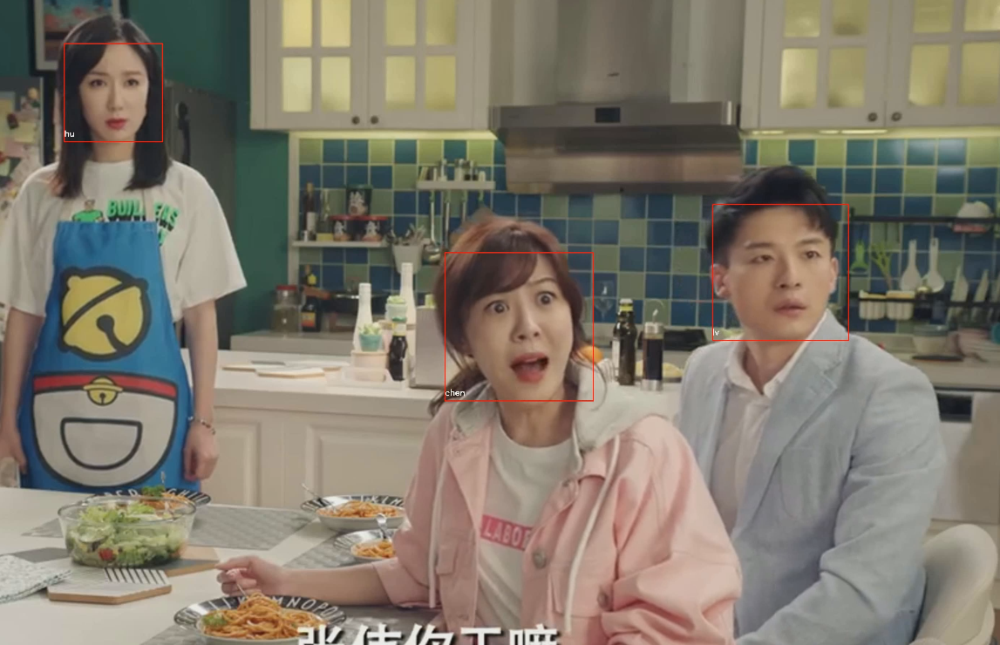

### 分析

- 使用MTCNN模型实现视频中的人脸检测：选择MTCNN（Multi-task Cascaded Convolutional Networks）实现视频人脸检测，可以实现小尺寸人脸检测、输出人脸边界框和关键点，为后续的人脸识别任务提供准确的输入。考虑到性能问题，这里每隔30帧获取一张图片，并输出一个对应的txt文本来标记人脸，人脸边界框和人脸关键点。
- 使用神经网络端到端方式进行人脸识别：利用深度学习方法实现端到端的人脸识别，设计一个适合人脸识别的卷积神经网络模型，如ResNet或FaceNet，直接从原始数据到识别结果，无需手动特征提取。此过程需要大量标注好的数据进行模型训练，同时验证集和测试集的构建对模型的泛化能力评估至关重要。

### 详细设计与实现

- 输入对齐和裁剪后的人脸图像：输入通过MTCNN检测并对齐、裁剪后的人脸图像。
- FaceNet模型：
  1. 卷积层提取特征：通过卷积层提取人脸的深度特征。
  2. 全连接层生成向量：将卷积层提取的特征通过全连接层，生成128维的特征向量。
- 输出128维特征向量：生成的人脸特征向量。
- 特征匹配：
  1. 计算欧几里得距离：计算待识别人脸特征向量与数据库中已知人脸特征向量之间的欧几里得距离。
  2. 找到最相似的向量：根据距离大小找到最相似的特征向量。
  3. 判断是否匹配：如果距离小于设定阈值，则认为匹配成功，输出对应的身份信息。
- 输出匹配结果（身份识别）：最终输出识别结果，即待识别人脸的身份信息。

### 使用方法

运行face_recognize.py即可。

### 效果

face_recognize.py的运行结果：

